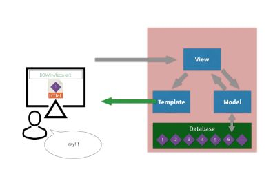

# Django 시작

## 0. 기본개념

Framework란?

* 어플리케이션 개발에 바탕이 되는 템플릿과 같은 역할을 하는 클래스와 인터페이스의 집합
* 이미 기본적인 구조, 완성된 코드를 바탕으로  웹서비스를 만드는 것을 도와줌

**Django**



* Django 수행 방식

  * M(Model) : 데이터를 관리
  * T(Template) : 사용자가 보는 화면
  * V(View) : 중간 관리자


## 1. 시작하기

### 0. 가상환경 실행 + .gitignore

> 가상환경을 사용하는 이유는 프로젝트마다 활용되는 라이브러리(pip)가 다르고, 동일한 라이브러리라도 버전이 다를 수 있다.
>
> 따라서, 프로젝트 하면서 라이브러리 삭제 혹은 변경을 하는 것이 아니라, 각 프로젝트마다 독립된 가상환경을 부여하여 의존성을 없앤다.
>
> 항상 django 실행할 때마다 가상환경을 활성화 시키는 것을 습관화 하자!
>
> 추후에 DataScience/MechineLearning/DeepLearning 학습 시에는 anaconda를 활용하기도 한다!

가상환경은 python에서 기본으로 제공하고 있는 [`venv`](https://docs.python.org/ko/3/tutorial/venv.html)를 활용한다.(python 3.5+)

1. 가상환경 생성

   ```bash
   $ python -m venv __venv__
   ```

   * `__venv__` 여기에 가상환경 이름을 작성하는데, 보통 `venv`라고 설정한다.
   * `__venv__`폴더가 생성되는데, 구조는 다음과 같다.
     * `Lib` : 가상환경에 설치된 라이브러리 모음.
     * `Scripts` : 가상환경 실행과 관련된 파일

2. 가상환경 실행

   ```bash
   $ ls
   venv/...
   $ source venv/Scripts/activate
   (venv)
   $ python -V
   Python 3.7.4
   ```

   * 반드시 해당 명령어는 `venv`폴더가 있는 곳에서 실행시킨다.
   * **`bash shell`에서는 `activate` 파일을 실행하여야 한다.**
     * `cmd` : `activate.bat`
     * `power shell` : `activate.ps1`

3. 가상환경 종료

   ```bash
   deactivate
   ```

4. `.gitignore` 등록

   ```shell
   venv/
   ```

   * 추가적으로 visual studio code 를 활용하는 경우에는 `.vscode/`
   * python 환경에서는 `__pycache__`
   * pycharm 환경에서는 `.idea/`

   위 폴더들은 `.gitignore`에 등록하는 습관을 가지자! 잘 모르겠으면 [gitignore.io](gitignore.io)에서 찾아서 복사하자 :)

### 1. 가상환경 설정 및 django 설치

```bash
$ python -m venv venv
$ source venv/Scripts/activate
$ django-admin startproject first_django .
```

```bash
$ pip install django
```

* 현재 활용하고 있는 버전은 다음과 같다
  * python 3.7.4
  * django 2.2.4

### 2. django 프로젝트 시작

```bash
$ mkdir __프로젝트 이름/폴더 이름__
$ cd __프로젝트 이름/폴더 이름__
```

```bash
$ django-admin startproject __프로젝트 이름__ .
```

* 프로젝트이름으로 구성된 폴더와, `manage.py`가 생성된다.
  * `__init__.py` : 해당 폴더가 패키지로 인식될 수 있게끔 작성되는 파일
  * `settings.py` : **django 설정과 관련된 파일**
  * `url.py` : **url 관리**
  * `wsgi.py` : 배포시 사용(web server gateway interface : 파이썬에서 사용되는 웹 서버 구성)
  * `manage.py` : **django 프로텍트와 관련된 커맨드라인(명령어 유틸리티)**

### 3. 서버 실행

```bash
$ python manage.py runserver
```

* `localhost:8000`으로 들어가서 로켓 확인!

### 4. app생성

```bash
$ python manage.py startapp __app이름__
```

* `app이름`인 폴더가 생성되며, 구성하고 있는 파일은 다음과 같다.

  - `admin.py` : 관리자 페이지 설정

  - `app.py` : app의 정보 설정

  - `models.py` : **MTV - Model을 정의 하는 곳**

  - `tests.py` : 테스트 코드를 작성하는 곳.

  - `views.py` : **MTV - View를 정의 하는 곳**

    - 사용자에게 요청이 왔을때, 처리되는 함수

      ```python
      def index(request):
          return render(request, index.html)
      ```

**app를 만들고 나서 반드시 `settings.py`에서 `INSTALLED_APPS`에 app를 등록한다.**

```python
# first_django/settings.py
# ..
INSTALLED_APPS = [
    'pages',
    'django.contrib.admin',
    '....'
]
# ....
```

## 2. 작성흐름

### 1. URL 정의

```python
# first_django/urls.py
from pages import views

urlpatterns = [
    path('',views.index),
]
```

* `urls.py`는 우리의 웹 어플리케이션 경로들을 모두 관리한다.
* 요청이 들어오면 `url.py`의 `urlpatterns`에 정의된 경로로 맵핑한다.
* path(`경로`, `view에 정의된 함수`)

### 2. View 정의

```python
# pages/views.py

def index(request):
    return render(request, 'index.html')
```

* `views.py`는 MTV에서 View에 해당한다.
* 일종의 중간관리자로 Model, Template 등의 처리를 담당한다.

### 3. Template 정의

* 기본적으로 app을 생성하면, `templates` 폴더가 없으므로 직접 생성해야 한다.

```html
<!-- pages/templates/index.htm; -->
<h1>
     장고 안녕!
</h1>
```

### 4. 서버 실행 및 확인

```bash
$ python manage.py runserver
```

`localhost:8000`에서 확인하자

[Document | The Django template language](https://docs.djangoproject.com/en/2.2/ref/templates/language/)

[Built-in template tags and filters](https://docs.djangoproject.com/en/2.2/ref/templates/builtins/)

- urls.py

```
from django.contrib import admin
from django.urls import path


# 1. url 설정
# pages app 의 views.py 파일 불러오기
from pages import views

urlpatterns = [
    path('admin/', admin.site.urls),
    # 1. url 설정
    # url, 해당하는 views의 함수
    path('', views.index),
    # variable routing
    # url의 특정 값을 변수처럼 활용
    path('cube/<int:number>/', views.cube),
]
```

- views.py : 모든 연산이나 로직처리는 view에서 할 것,

```
# 인자에 들어가는 변수는 urls.py에서 정의한 이름(number)과 같아야함!
def cube(request, number):
    result = number**3
    context = {
        'result': result,
        'number': number,
        'numbers': [1, 2, 3],
        'students': {'지수': '지수!'}
    }
    return render(request, 'cube.html', context)
```

- cube.html

```
<!DOCTYPE html>
<html lang="en">
<head>
  <meta charset="UTF-8">
```